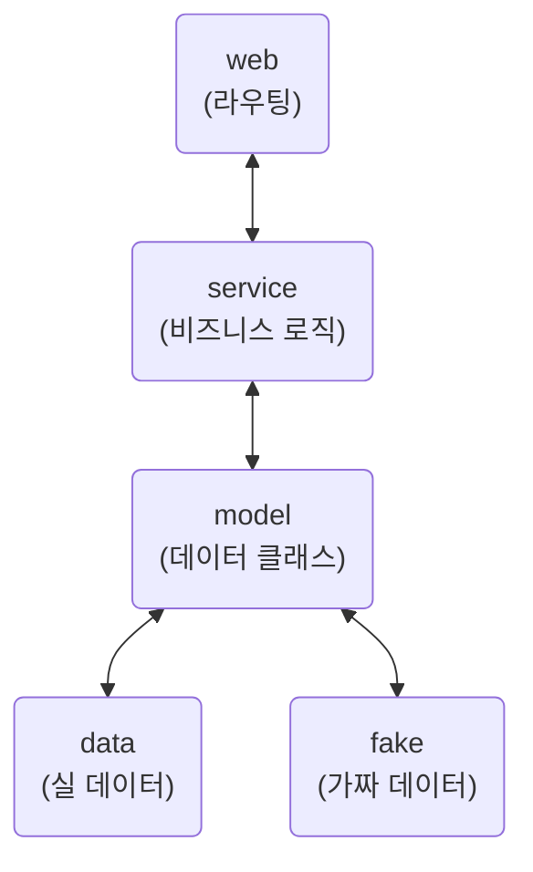

# 탐험가 실습

## 파일 구조

```shell
.
├── data
│   ├── __init__.py
│   ├── creature.py
│   └── explorer.py
├── fake
│   ├── __init__.py
│   ├── creature.py
│   └── explorer.py
├── main.py
├── model
│   ├── __init__.py
│   ├── creature.py
│   └── explorer.py
├── service
│   ├── __init__.py
│   ├── creature.py
│   └── explorer.py
└── web
    ├── __init__.py
    ├── creature.py
    └── explorer.py
```


